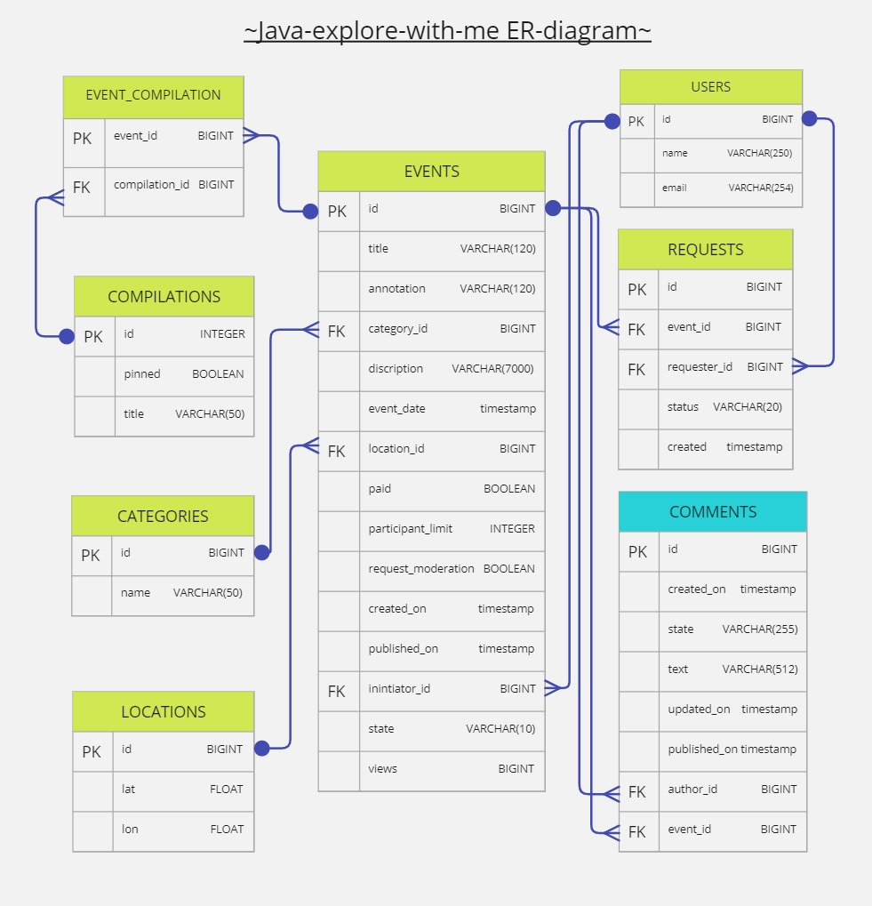

### [Pull request на доп. функциональность - "комментарии к событиям."](https://github.com/ddddubbbb/java-explore-with-me/pull/3)

# **Исследуй со мной**
Приложение, которое поможет найти компаньона для путешествия, похода в кино или другого совместного занятия.

Реализован функционал оценок и отзывов пользователей, фильтра, рекомендаций, поиска.

`Стек: Java, Spring Boot, SQL, H2, JdbcTemplate, JUnit.`
## API specifications

 
 Open in editor.swagger.io 
 

1. Main-service: [ewm-main-service-spec.json](/ewm-main-service-spec.json)

2. Stat-service: [ewm-stats-service-spec.json](/ewm-stats-service-spec.json)

## Схема базы данных

 
 ER-DIAGRAM 

## Этапы проектирования

 
 ТЗ  
 

## Этап 1. Сервис статистики

 
 ТЗ. Часть 1 
 

Первый этап — реализация сервиса статистики.

На первом этапе необходимо:
1. Реализовать сервис статистики в соответствии со спецификацией:
   [ewm-stats-service.json](https://raw.githubusercontent.com/yandex-praktikum/java-explore-with-me/main/ewm-stats-service-spec.json).
2. Реализовать HTTP-клиент для работы с сервисом статистики.
3. Подготовить сборку проекта.
4. Определиться с тематикой дополнительной функциональности, которую вы будете реализовывать.

### Базовые требования
Разработка должна вестись в публичном репозитории, созданном на основе
[шаблона](https://github.com/yandex-praktikum/java-explore-with-me).

Весь код первого этапа разместите в отдельной ветке с именем `stat_svc`.

### Что будет проверяться

* Работающая сборка проекта:
    * проект компилируется без ошибок;
    * сервис статистики успешно запускается в докер-контейнере;
    * экземпляр PostgreSQL для сервиса статистики успешно запускается в докер-контейнере.
* Корректная работа сервиса статистики:
    * все эндпоинты отрабатывают в соответствии со спецификацией;
    * данные успешно сохраняются и выгружаются из базы данных;
    * реализован HTTP-клиент сервиса статистики.,

  

## Этап 2. Основной сервис

 
 ТЗ. Часть 2 
  

Пришло время реализации основного сервиса! Для начала просмотрите ещё раз техническое задание и изучите
[спецификацию API основного сервиса](https://raw.githubusercontent.com/yandex-praktikum/java-explore-with-me/main/ewm-main-service-spec.json).

### Базовые требования
Реализация должна вестись в отдельной ветке с именем `main_svc`. Эта ветка должна основываться на ветке `main`,
в которую слиты изменения предыдущего этапа.

### Что будет проверяться
1. Работающая сборка проекта:
  * проект компилируется без ошибок;
  * основной сервис и сервис статистики успешно запускаются в Docker-контейнерах;
  * для каждого сервиса запускается свой экземпляр PostgreSQL в Docker-контейнере.
2. Корректная работа основного сервиса:
  * все эндпоинты отрабатывают в соответствии со спецификацией;
  * данные успешно сохраняются и выгружаются из базы данных;
  * основной сервис и сервис статистики корректно взаимодействуют;
  * реализация работы с данными не производит лишней нагрузки на базу данных.

## Этап 3. Дополнительная функциональность

 
 ТЗ. Часть 3 
 

### Базовые требования
Реализация дополнительной функциональности (comments — комментарии к событиям). 
На этом этапе вам предстоит, во-первых, реализовать саму функциональность, а также написать базовые Postman-тесты, 
которые будут проверять её работоспособность.

Реализация должна вестись в отдельной ветке с именем feature_comments.

### Что будет проверяться
* Работоспособность сервисов, реализованных на предыдущих этапах.
* Наличие базовых Postman-тестов. Они должны проверять коды ответов
  спроектированных вами эндпоинтов в рамках реализации выбранной функциональности.
* Полнота и корректность реализации выбранной функциональности.

### Путь к Postman-коллекции
Вам нужно экспортировать Postman-коллекцию и сохранить её в папке Postman.
Сам файл должен называться `feature.json`. Путь к файлу в репозитории
должен быть `postman/feature.json`.

 

